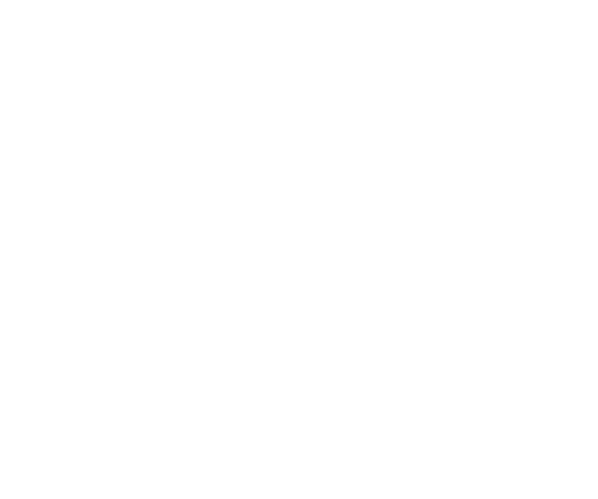

In this blog post I will give my explanation of the multi-head attention mechanism,
which is the core ingredient for the transformer architecture which underpins the latest
large-language models (LLMs) such as chatGPT and Claude.

The multi-head attention layer is parameterized by

* the _sequence_length_ $S$;
* the _input length_ $I$, the dimensionality of the input data/signal;
* the _output length_ $\mathcal{O}$, the dimensionality of the output data/signal;
* the _model dimension_ $D$, an internal dimensionality parameter; and
* the number of heads $N$.

## One attention head

Let's start with the case of one attention head. The generalization to multiple
heads will be straightforward after this.

The attention layer in this case is a function

$$
\operatorname{Attention}_{S, I, \mathcal{O}, D}: \mathbb{R}^{(S, I)} \to \mathbb{R}^{(S, \mathcal{O})}
$$

where $\mathbb{R}^{(S, I)}$ is the vector space of arrays of shape $(S, I)$. This says
that the input to attention is an array $X$ of shape $(S, I)$ and the output is
an array of shape $(S, \mathcal{O})$.

The $S$ axis can be thought of in various ways. When used in a language model,
the $S$ axis corresponds to position along a text input; in a time series model
the $S$ axis is the time axis.

The $I$ axis represents the input features or channels. In a language model,
each word in some input text gets mapped to an embedding vector of dimension
$I$, which is nicely explained in [this 3Blue1Brown
video](https://www.youtube.com/watch?v=wjZofJX0v4M&t=747s). In a time series
model, you might have several different signals that are measured at each point
in time, and the positions along the $I$ axis represent those different
signals.

An input array $X \in \mathbb{R}^{(S, I)}$ can thus be thought of as a sequence
of $I$-dimensional vectors $(x_p)$ indexed by the sequence axis $S$. With this
convention, the $S$-axis goes along the rows and the $I$-dimensional vectors
are row vectors.

:::{#fig-input}
{width="50%" fig-align="center"}

Attention input tensor of shape $(S, I)$
:::

The formula for attention is

$$
\begin{align}
\operatorname{Attention}(X) &=
  \operatorname{softmax}\bigg(
    \frac{1}{\sqrt{D}}
    QK^T
  \bigg) V
\end{align}
$$ {#eq-attn}

where $Q, K, V$ are called *queries*, *keys*, and *values* respectively. These
matrices are defined as

$$
\begin{align}
  Q &= XW_Q + b_Q \\
  K &= XW_K + b_K \\
  V &= XW_V + b_V
\end{align}
$$ {#eq-qkv}

The above formulas use matrix multiplication and the sum of the bias vector is
broadcasted across the sequence axis. By matrix multiplication we can write
this as an equation on the rows of $Q$, $K$, and $V$. For example, for the rows
$(q_p)$ of $Q$ we have

$$q_p = x_p W_Q + b_Q$$ {#eq-queries}

(and similarly for rows $(k_p)$ of $K$ and $(v_p)$ of $V$). If this equation
looks a little strange it's because it's an equation on _row_ vectors, whereby
matrices act on the right instead of the left. A consequence of this is that
the feature rows of $Q, K, V$ are completely localized to their position in the
sequence dimension; they do not contain information from other locations along
the input sequence.

The shapes of these arrays are
summarized in the following table. Note that $Q$, $K$, and $V$ can be visualized
similarly to $X$ as in @fig-input as sequences of vectors along the $S$-axis.

:::{style="width:30%; margin:0 auto;"}

| Array    | Shape                     |
|:--------:|:-------------------------:|
|  $W_Q$   |  $(I, D)$                 |
|  $W_K$   |  $(I, D)$                 |
|  $W_V$   |  $(I, \mathcal{O})$       |
|  $Q$     |  $(S, D)$                 |
|  $K$     |  $(S, D)$                 |
|  $V$     |  $(S, \mathcal{O})$       |

: {.striped .hover .sm .responsive}

:::

Each of the weights $(W, b)$ are free parameters of the layer that are learned
during model training.

### Attention Scores

The next step towards @eq-attn is the computation of the *attention scores*,
which are given by the matrix

$$
A = \operatorname{softmax}\bigg(
  \frac{1}{\sqrt{D}}
  QK^T
\bigg)
$$ {#eq-attn-matrix}

appearing in @eq-attn. Starting from the inside, the matrix $QK^T$ is the
matrix of dot-products between all query vectors and all key vectors.

$$
Q K^T =
\begin{pmatrix}
\textemdash q_1 \textemdash \\
\textemdash q_2 \textemdash \\
\textemdash q_3 \textemdash \\
 \vdots
\end{pmatrix}
\begin{pmatrix}
     |&     | &     | & \\
k_1^T & k_2^T & k_3^T & \cdots \\
     |&     | &     | & \\
\end{pmatrix} =
\begin{pmatrix}
q_1k_1^T & q_1k_2^T & \cdots & &\\
q_2k_1^T & q_2k_2^T & \cdots & & \\
\vdots   & \vdots   & \ddots & & \\
         &          &        & q_ik_j^T & \\
         &          &        &          & \ddots \\
\end{pmatrix}
\in \mathbb{R}^{(S, S)}
$$

A dot product $q_ik_j^T$ will be small when the query and key columns are very
different, and large when the they are nearly parallel. For this reason you can
think of the queries as retrieving information by "looking up" the keys using
dot products. When the query aligns with the key, that key gets selected, and
we might say that position $i$ _attends to_ position $j$.

We can start to see that the attention mechanism is like a fuzzy dictionary.
A query $q_i$ at position $i$ in the sequence "looks" at all keys $k_j$ along
the sequence by taking the dot product with them. When that has high alignment,
the associated value $v_j$ to $k_j$ will then contribute to the final output of
the attention layer at position $i$.

To understand the fuzzy part, we must continue digesting @eq-attn-matrix. I'll
come back to the $\sqrt{D}$ in a moment, so let's understand what's going on
with the softmax.

If we didn't have the softmax around, attention would output $AV= QK^T V$:

$$
\begin{align*}
QK^T V &= \begin{pmatrix}
q_1k_1^T & q_1k_2^T & \cdots & &\\
q_2k_1^T & q_2k_2^T & \cdots & & \\
\vdots   & \vdots   & \ddots & & \\
         &          &        & q_ik_j^T & \\
         &          &        &          & \ddots \\
\end{pmatrix}
\begin{pmatrix}
  \textemdash v_1 \textemdash \\
  \textemdash v_2 \textemdash \\
  \vdots\\
  \textemdash v_j \textemdash \\
  \vdots
\end{pmatrix} \\
&= \begin{pmatrix}
  (q_1k_1^T)v_1 + (q_1k_2^T)v_2 + \cdots + (q_1k_S^T)v_S \\
  (q_2k_1^T)v_1 + (q_2k_2^T)v_2 + \cdots + (q_2k_S^T)v_S \\
  \cdots\\
  (q_ik_1^T)v_1 + (q_ik_2^T)v_2 + \cdots + (q_ik_S^T)v_S \\
  \cdots
\end{pmatrix} \overset{\text{def}}{=}
\begin{pmatrix}
  \textemdash o_1 \textemdash \\
  \textemdash o_2 \textemdash \\
  \cdots \\
  \textemdash o_i \textemdash \\
  \cdots
\end{pmatrix}
\end{align*}
$$

The result[^parentheses] is a little messy, but it shows what is meant by
"fuzzy": the output vector $o_i$ at position $i$ in the sequence is a linear
combination of the value vectors, and each value $v_j$ contributes by an amount
proportional to the lookup weights $q_ik_j^T$.

Adding the softmax and factor of $\sqrt{D}$ back in doesn't alter this core
idea. The [softmax](https://en.wikipedia.org/wiki/Softmax_function) in
@eq-attn-scores is applied over the rows of $QK^T$, so it converts the set of
lookup weights for each output to a probability distribution:

$$
\operatorname{softmax}(q_ik_1^T/\sqrt{D}, q_ik_2^T/\sqrt{D}, \dots, q_ik_S^T/\sqrt{D})
  \mapsto (a_{i,1}, a_{i, 2}, \dots, a_{i, S})
$$

where

$$
\begin{align}
  a_{i, j} = \frac{\exp(q_ik_j^T/\sqrt{D})}{\sum_{l} \exp(q_ik_l^T/\sqrt{D})}.
\end{align}
$$ {#eq-attn-scores}

are the *attention scores*. The output array's $i^{\text{th}}$ row still looks like a
linear combination of value vectors:

$$
  o_i = a_{i, 1}v_1 + a_{i, 2}v_2 + \dots a_{i, S}v_S.
$$ {#eq-attn-output}

Now, it's not the lookup weight $q_ik_j^T$ but rather a scaled version[^softmax-comment] of its
exponential in @eq-attn-scores that tells us how much $v_j$ contributes to
$o_i$. We get a maximal contribution when $q_i$ is parallel to $k_j$, and a
minimal contribution when they are anti-parallel.

#### Normalizing Factor $\sqrt{D}$

The normalizing factor of $\sqrt{D}$ in these equations is to make sure that
the softmax operation doesn't become oversaturated. Roughly what happens is the
lookup weights $q_ik_j^T$ have a variance equal to $D$, so you can expect that
several of them are much larger than others. Due to the exponentials in the
definition of softmax in @eq-attn-scores, these much larger values dominate the
softmax and most other weights are near $0$. Scaling by $\sqrt{D}$ brings the
variance down to 1, and that ensures that it is unlikely for one particular
lookup weight to dominate.

For more details, see [this great stackexchange answer](https://ai.stackexchange.com/a/42197).

## Multiple Heads

Generalizing to multiple heads is straightforward: if $N$ is the number of
heads, you chop up the model dimension $D$ into $N$ bins and apply the
attention formula @eq-attn $N$ times, using $D_{head} = D / N$ in place of $D$
and $\mathcal{O}_{head} = \mathcal{O} / N$ in place of $\mathcal{O}$.

For each $n = 1, 2, \dots, N$, the $n$th attention head outputs an array of
shape $(S, \mathcal{O}_{head})$ whose rows are $o_i^{(n)}$. Each of the
$o_i^{(n)}$ have the same mathematical form as @eq-attn-output, except all the
row vectors $q, k, v$ of each matrix have reduced length (which means
$o_i^{(n)}$ also has reduced length because it's a sum of $v$'s). They then fit
together to form the final output vector $o_i$:

$$
o_i = \begin{pmatrix}
  o_i^{(1)} & \bigg| & o_i^{(2)} & \bigg| & \cdots & \bigg| & o_{i}^{(N)}
\end{pmatrix}
$$ {#eq-attn-multi-output}

When allowing for more heads, we are deciding that our output features are
grouped into sub-outputs, each of which has an attention head behind it. These
different groups are then free to learn about different features of the input
array $X$. This is similar to how a convolutional layer with multiple features
can learn to pick out distinct components of the input signal.

## Positional Encodings

So at this point we've fully defined the attention layer; the output array has
rows $o_i$ given by @eq-attn-output (or @eq-attn-multi-output when multiple
heads are used).

However, everything that goes into the attention scores $a_{i,j}$ is purely based
on the values _at_ each position, but it does not make use of the relative position
of each query and key. Basically, we're only looking at how values at $i$ compare to
values at $j$, but we haven't actually included information about how _close_ $i$ is to $j$.

To illustrate this a bit a further, consider the following sentence.

> They decided to park the car in the park.

By our construction, queries will attend to the word "park" at both occurrences
with equal attention, because both "park"s will have the same key and value vectors.
The missing context is how far apart the words are; a good model would probably learn to 
attend differently to the same word at different locations in the sentence.

One solution is to add positional encoding to the sequence at some point before
we calculate attention scores. I'll briefly mention two methods in this post:
fixed vector encodings and rotational encodings. There are many variants of these
out there, and these two are relatively common.

### Fixed Vecors

The easiest way to add positional encoding is to add on a fixed vector at each point
along the sequence. We take vectors $\epsilon_1, \epsilon_2, \dots, \epsilon_S
\in \mathbb{R}^I$ and use $x_p + \epsilon_p$ instead of x_p$ in @eq-queries,
and allow these vectors to be learnable parameters during training.
This was the strategy used in the [original paper][attention is all you need].
The method is pretty simple, but it turns out to not lead to the best results.

This method also lacks translation invariance. The transformer only knows to
distinguish positions based on the raw values of the $\epsilon_i$, and if you
were to shift your input sequence you might get different results due to the
shifted input matching up with different $epsilon_i$.

### Rotational Encodings

A more sophisticated approach appearing the [Roformer][roformer] paper involves
rotating the queries $Q$ and keys $K$ by rotations $R_1, R_2, ..., R_S$ such
that any neighboring rotations differ by the same angle $\theta$. This breaks
the symmetry we observed above, and moreover it is less sensitive to
translations, because the _relative_ rotation is preserved along the sequence.
This paper has shown this to be a more effective method of positional encoding
than the fixed vector approach.

[^layer]: By "layer" here I mean as a layer in a neural network; it is a
function that consumes input data arrays and outputs arrays.

[^parentheses]: Note that in general, you cannot turn the parentheses around to
write $o_i = q_i(k_1^Tv_1 + \cdots + k_S^Tv_S)$, because unless $D =
\mathcal{O}$, the dot product $k_j^T v_j$ does not make sense.

[^softmax-comment]: Note that the denominator of the softmax values $a_{i,j}$ is the same for all $j$.

[roformer]: https://arxiv.org/abs/2104.09864

[attention is all you need]: https://arxiv.org/abs/1706.03762

